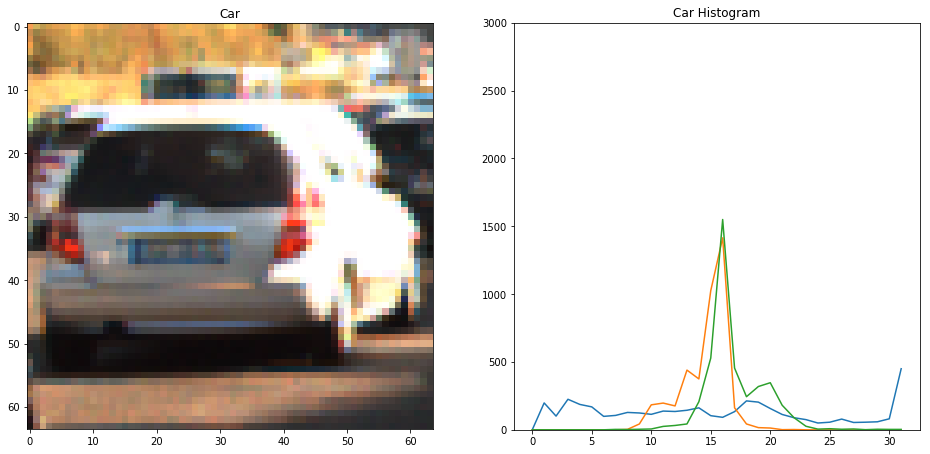
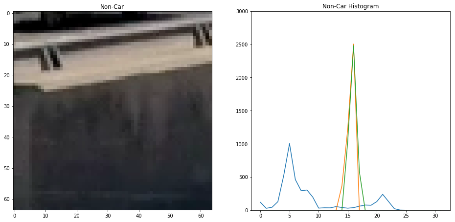

# Vehicle Detection Project

The goals / steps of this project are the following:

* Perform a Histogram of Oriented Gradients (HOG) feature extraction on a labeled training set of images and train a classifier Linear SVM classifier
* Optionally, you can also apply a color transform and append binned color features, as well as histograms of color, to your HOG feature vector. 
* Note: for those first two steps don't forget to normalize your features and randomize a selection for training and testing.
* Implement a sliding-window technique and use your trained classifier to search for vehicles in images.
* Run your pipeline on a video stream (start with the test_video.mp4 and later implement on full project_video.mp4) and create a heat map of recurring detections frame by frame to reject outliers and follow detected vehicles.
* Estimate a bounding box for vehicles detected.

See code and more example of the pipeline in [the notebook](./VehicleDetection.ipynb). Here's a [link to the test video result](./test_video_output.mp4).

## Feature Exaction
To differentiate between car images and non-car images, 4 types of features are extracted from each training image, **Red Colors**, **Histogram of Oriented Gradients (HOG)**, **Binned Colors**, **Histogram of Colors**.

### Color Space

Except extracting first feature, Red Colors, all other features are extracted from YUV color space, where Y is defined by luma and UV are defined by two chrominance components.

YUV color space and all channels were selected, based on test accuracy of each classifier with respect to each color space. The accuracies were averaged from 3 test runs each color space / channel.

| Channel | RGB | YCrCb | HLS | LUV | YUV |
|----:|:--:|:--:|:--:|:--:|:--:|
|0|	94.00|	95.33	|94.83	|95.17|	95.00|
|1|	94.83	|97.67	|95.33	|96.67	|95.67|
|2|	94.33	|94.50	|91.33|	93.67|	95.33|
|All|	95.50	|97.33	|98.17	|**98.33**	|**98.33**|

LUV was also considered due to its accuracy is very close to YUV. However in real test, there seems to be more misidentification using LUV.

### Features
#### Feature 1 - Red Colors

#### Histogram of Oriented Gradients (HOG)

#### Binned Colors

#### Histogram of Colors

### Feature Normalization

## Classifiers
| Classifier | Training Time (sec) | Testing Time (sec) | Accuracy (%) | Considered | Comments |
|-----------:|:--------------:|:--------------:|----------|:---:|----|
| LinearSVC  | 10.62 | 0.05 | 99.90138067061144 | Y | |
| DecisionTreeClassifier | 12.54 | 0.07 | 99.70414201183432 | Y | |
| SGDClassifier | 0.73 | 0.03 | 99.90138067061144 | Y | |
| SVC | 50.42 | 12.68  | 99.95069033530573 | N | Accuracy is great, but expensive to train and test.|
| RandomForestClassifier |  2.45 | 0.16 | 99.65483234714004 | N | Could be considered, but does not add too much to the over all accuracy, since DecisionTreeClassifier is already used. |
| MLPClassifier | 40.85 | 0.62 | 99.90138067061144 | N | Misidentified few positive falses in real test for some reason, although test accuracy is high. Could be because of not enough training data. |
| GaussianNB |  2.34 | 0.77 | 99.11242603550295 | N | Misidentified few false positives in real test for some reason, although test accuracy is not bad. |
| QuadraticDiscriminantAnalysis | 172.19 | 5.79 | 51.77514792899408 | N | Low accuracy. Too expensive to train and test. |
| AdaBoostClassifier | 474.73 | 1.04 | 100.00 | N | Too good to be true. Very expensive to train. |

## Detection

### Search Area

### Sliding Window Search

### Classifier Vote

### Heatmap

### Use of Previous Results