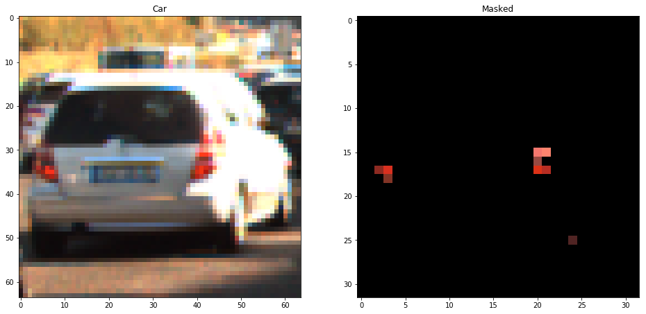
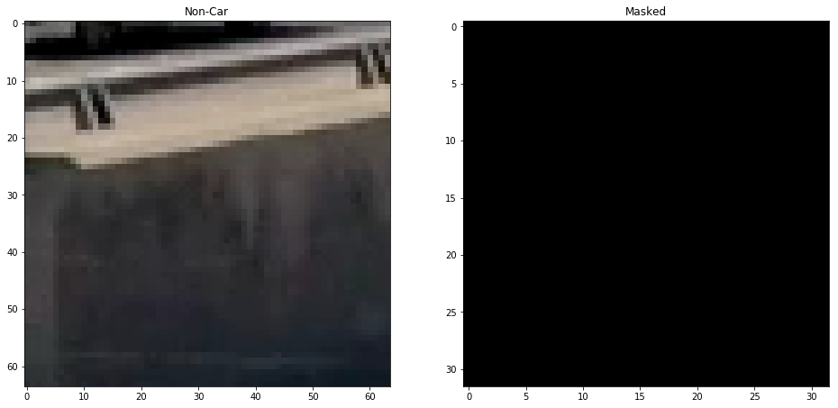
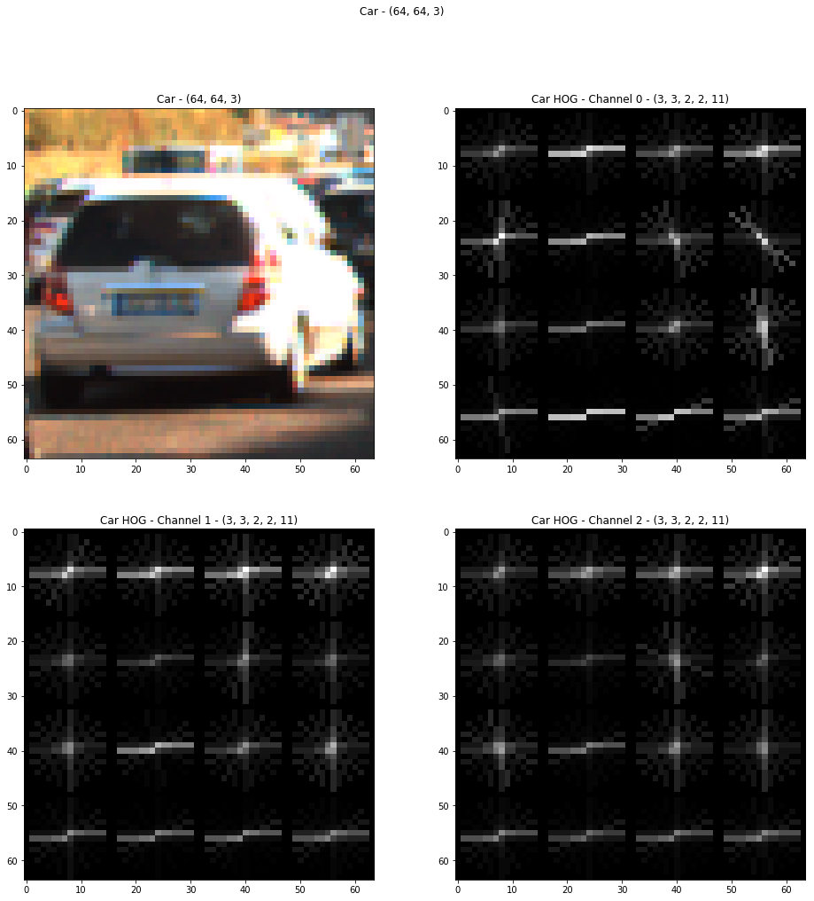
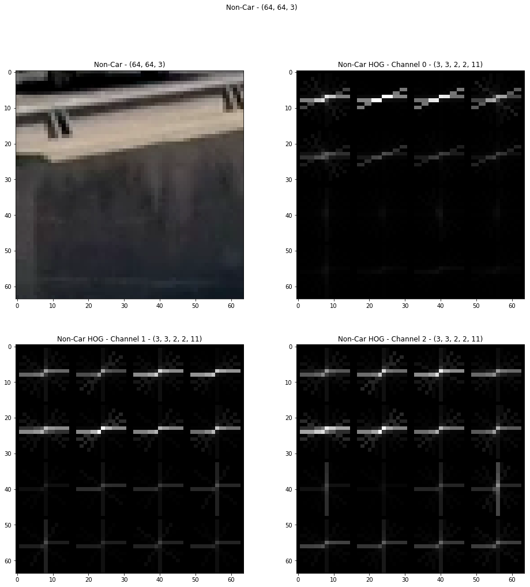
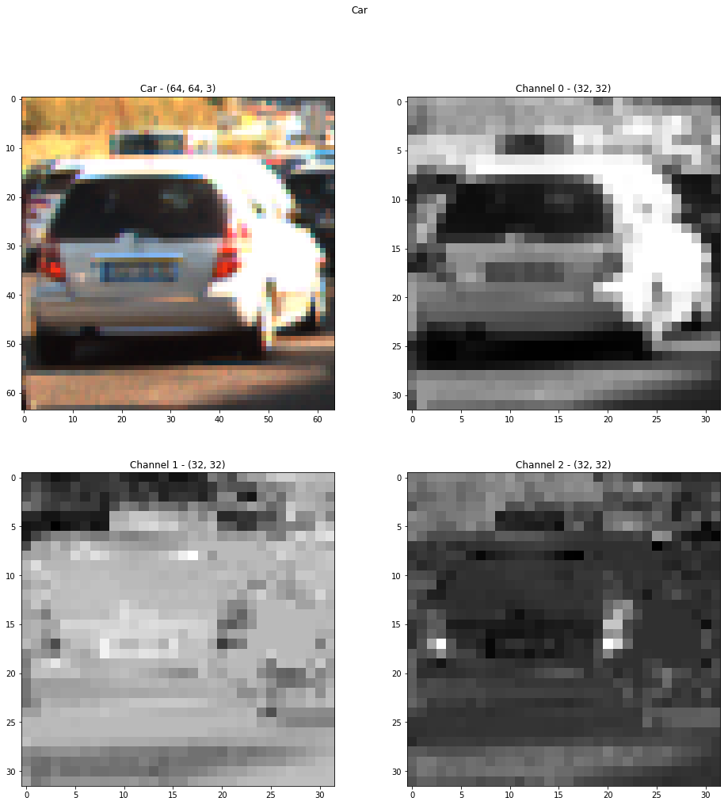
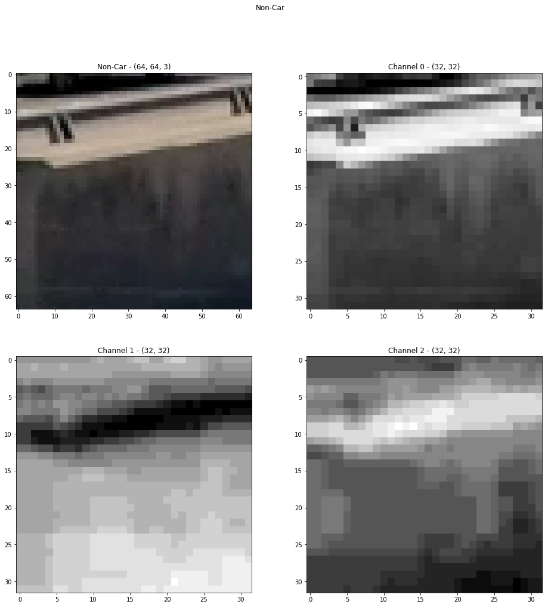
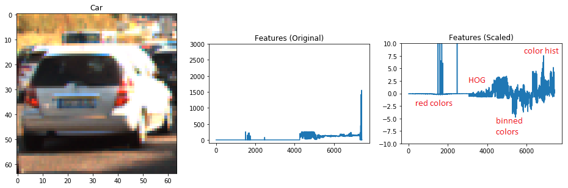
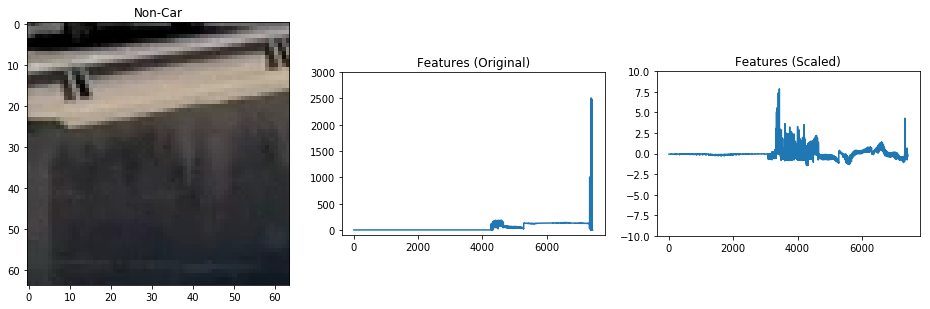

# Vehicle Detection Project

The goals / steps of this project are the following:

* Perform a Histogram of Oriented Gradients (HOG) feature extraction on a labeled training set of images and train a classifier Linear SVM classifier
* Optionally, you can also apply a color transform and append binned color features, as well as histograms of color, to your HOG feature vector. 
* Note: for those first two steps don't forget to normalize your features and randomize a selection for training and testing.
* Implement a sliding-window technique and use your trained classifier to search for vehicles in images.
* Run your pipeline on a video stream (start with the test_video.mp4 and later implement on full project_video.mp4) and create a heat map of recurring detections frame by frame to reject outliers and follow detected vehicles.
* Estimate a bounding box for vehicles detected.

See code and more example of the pipeline in [the notebook](./VehicleDetection.ipynb).

## Data
The labeled images for training and testing in this project come from [vehicles.zip](https://s3.amazonaws.com/udacity-sdc/Vehicle_Tracking/vehicles.zip) and [non-vehicles.zip](https://s3.amazonaws.com/udacity-sdc/Vehicle_Tracking/non-vehicles.zip).

## Feature Exaction
To differentiate between car images and non-car images, 4 types of features are extracted from each training image, **Red Colors**, **Histogram of Oriented Gradients (HOG)**, **Binned Colors**, **Histogram of Colors**.

### Color Space

Except extracting first feature, Red Colors, all other features are extracted from YUV color space, where Y is defined by luma and UV are defined by two chrominance components.

YUV color space and all channels were selected, based on test accuracy of each classifier with respect to each color space. The accuracies were averaged from 3 test runs each color space / channel.

| Channel | RGB | YCrCb | HLS | LUV | YUV |
|----:|:--:|:--:|:--:|:--:|:--:|
|0|	94.00|	95.33	|94.83	|95.17|	95.00|
|1|	94.83	|97.67	|95.33	|96.67	|95.67|
|2|	94.33	|94.50	|91.33|	93.67|	95.33|
|All|	95.50	|97.33	|98.17	|**98.33**	|**98.33**|

LUV was also considered due to its accuracy is very close to YUV. However in real test, there seems to be more misidentification using LUV.

### Features
#### Feature 1 - Red Colors

Unlike other features, this feature for each training image is extracted from RGB color space instead of YUV color space. The idea is to identify whether an image contains a car or not, based on the level and position of the red colors. This is based on the fact that almost every car has red braking lights at the back.

```python
def get_red_features(img, size):    
    img = cv2.resize(img, size)

    img_r = img[:,:,0]
    img_g = img[:,:,1]
    img_b = img[:,:,2]

    img_bg = cv2.add(img_b, img_g)

    mask = (img_r > img_bg).astype(np.uint8) * 255

    img_masked = cv2.bitwise_and(img, img, mask=mask)
    return img_masked.ravel()
```

In the code it also resizes the image before extracting red colors, in order to eliminate any small red dots due to light distortion for example. At the end it flattens the masked image into one row before returning.

In the car example below, the two red braking lights are accurately extracted. There is one extra dark red point in the low-right, which is fine since it's not common to all car images.



In the non-car example below, no red color is found as expected.



#### Histogram of Oriented Gradients (HOG)

After scanning thru all labelled images, it is found that there are about 10% of car images come with no red colors, and about 10% of non-car images come with red colors. To avoid misidentifying these images, we will have to use [HOG](https://www.learnopencv.com/histogram-of-oriented-gradients) information which is less color relevant. 

For this project [`hog()` function](http://scikit-image.org/docs/dev/auto_examples/features_detection/plot_hog.html) provided by *scikit-image* is used.

```python
def get_hog_features(img, orient, pix_per_cell, cell_per_block, vis, feature_vec, channel):
    return hog(img[:,:,channel], orientations=orient, 
               pixels_per_cell=(pix_per_cell, pix_per_cell),
               cells_per_block=(cell_per_block, cell_per_block), 
               transform_sqrt=False, 
               visualise=vis, feature_vector=feature_vec, block_norm='L2-Hys')
```
where
```python
orient = 11
pix_per_cell = 16
cell_per_block = 2
```

Originally `orient` was `9` and `pix_per_cell` was `8`. They were increased to current values to speed up the pipeline for the video. 

In the car example below, we can recognize that the surrounding vectors in the HOG image for channel 0 (upper right image), i.e. (Y) luma channel, roughly forms a closed rectangle.



In the non-car example below, it is hard to see rectangle in any of the HOG images.



#### Binned Colors

There are cases where an image has red colors and shape found in HOG is kind of rectangle, but it could be a stop sign. To differentiate these images from real car images, we want the classifiers to look at binned colors of the image, to check colors in different areas and amounts.

```python
def bin_spatial(img, size, channel):
    return cv2.resize(img[:,:,channel], size).ravel()
```

Here are the examples of binned colors for the car image and the non-car image.




The differences in these features between a car image and a non-car image can be very small. The detection will mostly rely on the red color feature and HOG feature described previously. In video testing, adding these two features actually increases the accuracy a little, so they are kept.

### Feature Normalization

After obtaining all features for each image, the features are combined in the same order as listed above. That is, [red colors + HOG + binned colors + histogram of colors].

However the combined feature values must be normalized to the same scale, to avoid some information being dominant. 




In the examples above, we see that the biggest differentiator between car and non-car images is red color features coming from braking lights. HOG makes a difference too. The remaining of the features do not differ too much, but still contributes per the real video testing.

## Classifiers

To decide which classifier to use, testing for each classifier was performed to obtained comparable accuracy. The training images are shuffled and splitted into 80% images for training and 20% for testing. Each test was performed 3 times to average the accuracy. 

| Classifier | Training Time (sec) | Testing Time (sec) | Accuracy (%) | Considered | Comments |
|-----------:|:--------------:|:--------------:|----------|:---:|----|
| LinearSVC  | 10.62 | 0.05 | 99.901 | Y | |
| DecisionTreeClassifier | 12.54 | 0.07 | 99.704 | Y | |
| SGDClassifier | 0.73 | 0.03 | 99.901 | Y | |
| SVC | 50.42 | 12.68  | 99.950 | N | Accuracy is great, but expensive to train and test.|
| RandomForestClassifier |  2.45 | 0.16 | 99.654 | N | Could be considered, but does not add too much to the over all accuracy, since DecisionTreeClassifier is already used. |
| MLPClassifier | 40.85 | 0.62 | 99.901 | N | Misidentified few positive falses in real test for some reason, although test accuracy is high. Could be because of not enough training data. |
| GaussianNB |  2.34 | 0.77 | 99.112 | N | Misidentified few false positives in real test for some reason, although test accuracy is not bad. |
| QuadraticDiscriminantAnalysis | 172.19 | 5.79 | 51.775 | N | Low accuracy. Too expensive to train and test. |
| AdaBoostClassifier | 474.73 | 1.04 | 100.000 | N | Too good to be true. Very expensive to train. |

The [classifiers](./classifiers) folder has all the tests for each classifier listed above.

At the end, instead of choosing an individual classifier, 3 classifiers (listed as considered in the above table) were combined. A car is only identified if every classifier recognize it.

## Sliding Window Search

There are few strategies for slide window searching, in order to increase accuracy of car detection as well as reducing false positives.

* *Search Area* - Althought flying car program was recently introduced on Udacity, it is rare to see car flying in the sky as of now. Even if there is, it would not be a concern for self-driving car on the ground. Therefore, the search starts at the middle of the image and scans thru the second half of the image at the bottom.

    

* *Perspective Search* - Objects farther are going to appear smaller and vice versa. Neither house-size vehicle or desk-size vehicle normally exists on our daily commute. Thus the area to search is 'zoomed' based on the `scale` value. The horizontal light yellow lines in the example image above shows how perspective search is done.

    ```python
        y_sub_start = 64 - int(scale * 20)
        y_sub_end = int(scale * 100)
        ctrans_tosearch = ctrans_tosearch[y_sub_start:y_sub_end, :]
    ```

* *Heatmap* - Search boxes where a car is believed to exist in each, by classifiers, can overlap.  Value for the same pixel covered by the search boxes adds up. When value is high, i.e. search boxes overlap, the chance that is actually a car is high, and vice versa. Occasionally an area in the image can be misidentified as a car. However its appearance on the heatmap can be light and below the threshold, thus will be ignored.

* *Use of Previous Results* - We should take advantage of previous frames when detecting cars on a video clip. In the code it keeps records of search boxes that contain a car from last `num_history = 6` frames. When constructing heatmap, both current boxes and previous boxes are used. For example, in the image below, no car in the current frame was detected by any classifier for some reason. Fortunately it has search results from previous frames, represented as dark yellow boxes. Otherwise the heatmap will be blank.

    

Here's a [link to the project video result](./project_video_output.mp4).